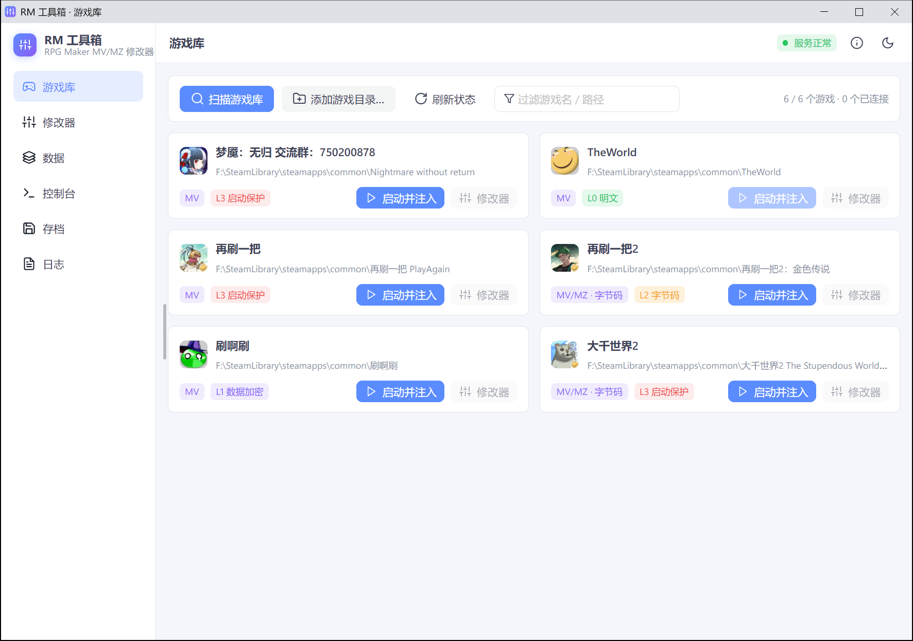
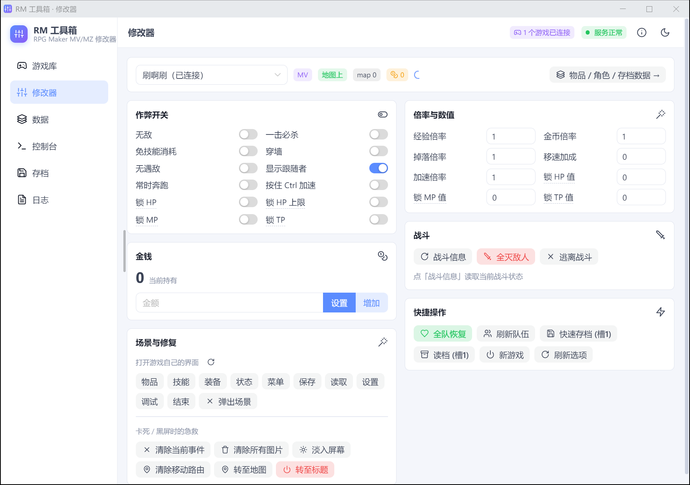
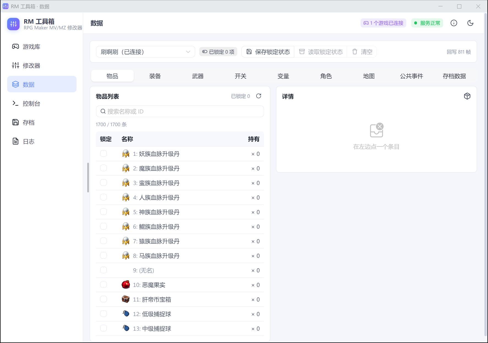

# RM 工具箱（RM Toolbox）

免费开源的 RPG Maker MV / MZ 单机游戏修改器，Windows 平台。自带图形界面，
不改游戏目录里的任何文件：启动游戏时把修改功能一起带进去，关掉就没了。





## 下载

到 [Releases](https://github.com/MengTL4/RMToolbox/releases) 下载最新的
`RMToolbox-vX.Y.Z-win-x64.zip`，解压后双击 `RMToolbox.exe` 就能用。
不需要安装 Node.js 或任何运行环境。

## 怎么用

1. 打开后先在「游戏库」点**扫描**，会自动找出 Steam 库里的 RPG Maker 游戏；
   不在库里的可以手动添加游戏目录。
2. 选中游戏点**启动**，工具会把游戏跑起来并连上修改功能。
3. 连上之后用左侧页签操作：

- **修改器**：无敌、锁血、倍率、金钱、战斗操作，还有游戏卡死时的急救按钮
  （清除事件、淡入屏幕、回到地图等）。
- **数据**：物品/装备/开关/变量/角色/地图的列表编辑。列表里勾选 = 锁定那个值
  （商店扣钱、事件消耗道具都会被立刻改回来）；角色页签可以学技能、附加状态，
  带游戏内图标；「存档数据」页签能直接编辑整份存档（JSON 树）。
- **存档**：存档槽位列表、快速存读档、备份与恢复。改存档前建议先备份。
- **控制台**：直接在运行中的游戏里执行 JavaScript。

## 功能一览

- 战斗：无敌、一击必杀、锁 HP/MP/TP（值和上限）、免技能消耗、全灭敌人、逃离战斗
- 角色：等级/经验/属性修改、技能学习、全队恢复
- 资源：经验/金币/掉落倍率、金钱修改、移速加成、游戏加速（按住 Ctrl）
- 数据：物品/武器/防具/开关/变量编辑与锁定
- 跑图：穿墙、不遇敌、常时奔跑、地图点击传送
- 存档：存读档、自动备份、存档数据树编辑
- 杂项：游戏内界面跳转、卡死修复、V8 控制台

## 安全说明

- 只适用于本地单机游戏，请勿用于任何带在线排行、联机或账号系统的游戏。
- 不修改游戏安装目录里的文件；所有改动都在内存里，重启游戏即还原（存档除外）。
- 「存档数据」编辑会改变存档结构，改之前请先在「存档」页备份。

## 从源码运行

想自己改代码或跟进开发版：

- 需要 **Node.js ≥ 18** 和一份 **NW.js 0.54 运行时**（[nwjs.io/downloads](https://nwjs.io/downloads/)，
  sdk 或 normal 版均可，解压到仓库根的 `nwjs/` 目录；也可以在 `config.local.json` 里写
  `{ "nwRuntimeDonor": "D:\\path\\to\\nw-runtime" }` 指定位置）。
- 启动 GUI：`powershell -NoProfile -ExecutionPolicy Bypass -File tools\launch-gui.ps1`
  （首次会自动链接 NW 运行时并构建，然后开窗）。
- 测试：`npm test`。

命令行工具（无需 GUI）：

```powershell
node tools/rmch.mjs scan                 # 扫描 Steam 库，识别引擎
node tools/rmch.mjs launch <gameRoot>    # 注入并启动游戏
node tools/rmch.mjs send <gameKey> gold.set '{"value":10000}'
```

## 参与开发

架构、bridge 分片结构、GUI 技术栈约束、打包 Release 等见
[docs/DEVELOPMENT.md](docs/DEVELOPMENT.md)。四个游戏的验收记录见
[docs/ACCEPTANCE.md](docs/ACCEPTANCE.md)。

## 许可证

[MIT](LICENSE)
